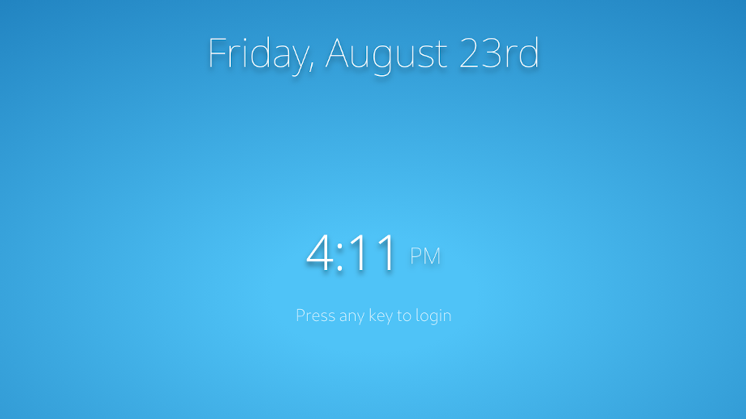

# $name
###  A customizable lightdm-webkit2-greeter interface

## Examples

## Installation
Install the lightdm and its webkit greeter, make sure that no other version of lightdm is installed on your system.

If your are not already using lightdm, install `lightdm` and `lightdm-webkit2-greeter`.

#### Arch and Manjaro
`# pacman -S lightdm lightdm-webkit2-greeter`
#### Debian (Ubuntu)
`# apt-get install lightdm lightdm-webkit2-greeter`

Now edit the lightdm config, in `/etc/lightdm/lightdm.conf` and set it to use the webkit2 greeter instead.
```
[Seat:*]
...
greeter-session=lightdm-webkit2-greeter
...
```


Next clone the this repo and copy it to the webkit2 themes folder. (You will need
root permission for the copy)

```
$ git clone https://github.com/jelenis/$name.git
# cp -r lightdm-theme /usr/share/lightdm-webkit/themes/
```

Lastly, set the value of theme in `/etc/lightdm/lightdm-webkit2-greeter.conf` to $name

```
[greeter]
...
webkit_theme = $name
```
## Usage
### Basic Usage
See [theme.js](js/theme.js) and [theme.css](css/theme.css) for basic usage.

### API
The [LoginManager](js/LoginManager.js) provides the basic faclities for
authenticating and starting the user session through an asynchronous event based
API. This adds layer of abstraction between UI code and the lightdm interface.

#### LoginManager Interface
Defined in `js/LoginManager.js` as must be included after all Plugins and other dependencies.

_Example: Creating a LoginManager._
```
// define a singleton LoginManager
let greeter = new LoginManager();
```
Any code that uses the LoginManager should only be performed after it has
finished initializing itself and all of its plugins. The `ready` event can be
used to so.

_Example: Using LoginManager `ready` event._
```
// called after greeter and lightdm are initialized
$(greeter).on("ready", function(e) {
  // authentication code goes here
});
```

#### Authetication
A user must be authenticated prior to attempting to login.
`auth(username="", password="", callback)` will asynchronously authenticate,
triggering the appropriate `grant` or `deny` event and passing the resulting
boolean to the callback function.

_Example: Authentcating a user when the enter key is pressed in a password field._
```
/* Attempt authentication, 'grant' event will be emitted on sucecss
and 'deny' will be emitted on failure */
if (e.keyCode == 13) { // Enter key
  let username = $user.children("option:selected").val();
  let pass = $password.val();
  greeter.auth(username, pass); // no callback specified
}
```
#### Logging in (starting user session)
Once authentication has been performed you can start a user session with
`login(session_key)`

_Example: listenting for authentication and starting a user session_
```
// when the user is authenticated, do a transition and login
$(greeter).on("grant", () => {
  let session_key = $session.children("option:selected").val();
  greeter.login(session_key);
})
.on("deny", () => {
  // inform the user that the credentials are invalid
  $password.removeClass("valid").addClass("invalid");
  $password.val("").prop("placeholder", "Incorrect Password");
});
```

#### LoginManager Public Definitions
Properties          | Definition                               | Description
  ---               |                                          |---
  auth              | auth(username="", password="", callback) | Authenticates a user
  login             | login(session_key)                       | Starts a user session
  shutdown          | shutdown()                               | Poweroff the pc
  hibernate         | hibernate()                              | Hibernate the pc
  restart           | restart()                                | Restart the pc
  users             | get users()                              | Returns array of user objects
  sessions          | get sessions()                           | Returns array of sessions objects
  fillUserSelect    | fillUserSelect($el)                      | Populates jQuery select element with users
  fillSessionSelect | fillSessionSelect($el)                   | Populates jQuery select element with sessions

#### List of Events

Event    | Description
---      | ---
deny     | Triggered after an unsucessful attempt to authenticate using `auth`
grant    | Triggered after successfuly authenticating using `auth`
init     | Triggered by LoginManager after the 'load' event has been fired by a plugin
load     | Triggered by Plugins after they have finished loading their config files
ready    | Triggered by Plugins and LoginManager after they have finished initailizing
active   | Triggered once by  SplashScreen Plugin after the user interacts with the SplashScreen
inactive | Triggered by the SplashScreen Plugin after a period of inactivity

#### Plugins
Plugins are stored in the LoginManager's `plugin` property and are
dynamically generated by the `plugins` array in
[LoginManager.json](json/LoginManager.json).

_Example: The SplashScreen plugin in LoginManager's config_
```
"plugins": [
  "SplashScreen"
]
```
<!--  [SplashScreen](#splash-screen) -->

##### Example: SplashScreen
The SplashScreen plugin provides facilities to easily add content to a splash
screen without having to worry about the details of implementation. Splash
screen  content can be changed in its config file
[SplashScreen.json](json/SplashScreen.json).

###### General

The general settings for this plugin are specified in the root of the `.json`
config file. The code will generate the content on this splash
```
"img": "",             // path to background image (can be left blank for none)
"fit": false,          // fits the background image to screen size, if there is one
"filter": false,       // applies blur to background image
"vignette": true,      // applies dark vignette to background image
"active-timeout": 15,  // specifies the timeout for active/inactive events
"transition": "fade",  // "fade" or "slide" to transition SplashScreen
```

###### Content: Clocks


The date in the sample image above is created and automatically
updated with the following clock object. You can use custom CSS to style and
position your clock. The `parent-css` property will allow you to add CSS to the
clocks outer `div`.

```
"content": {
  "clock": [{
    "format": "dddd, MMMM Do",
    "css": {
      "color": "white"
    },
    "parent-css": {
      "margin-top": "calc(20vh - 70pt)",
      "text-align": "center",
      "font-size": "70pt",
      "font-family": "Noto Sans",
      "font-weight": "lighter",
      "text-shadow": "rgba(0, 0, 0, 0.5) 0px 7px 10px",
    }
    ...
```

To add the sytlized time to our splash screen we need to add another clock. This
one will consist of two parts one for the actual time and another for the sylized
AM/PM. This means formats, and thus two css objects.

```
"content": {
  "clock": [{
    ...
},{
  "format": ["h:mm", "A"], // two formats for two clocks on the same line
  "css": [
    {"font-size": "65pt", "font-weight": 200 },
    {"font-size": "30pt", "font-weight": "lighter", "margin-left": "10pt"}
  ],
  "parent-css": {
    "margin-top": "20vh",
    "color": "white",
    "font-family": "Noto Sans",
    "text-align": "center",
    "text-shadow": "rgba(0, 0, 0, 0.5) 0px 7px 10px",
  }
}],
```

###### Content: html
Provides an interface to add any custom content to the SplashScreen.

_Example: adding welcome text to SplashScreen, see default theme for an image._
```
content: {
  "html": [{
    "html":"<text style='display: none' class='active-appear'>Press any key to login</text>",
    "css": {
      "margin-top": "5vh",
      "font-weight": "200",
      "font-size": "23pt",
      "text-align": "center",
      "color": "rgba(255, 255, 255, 0.8)"
    }
  }]
}
```
